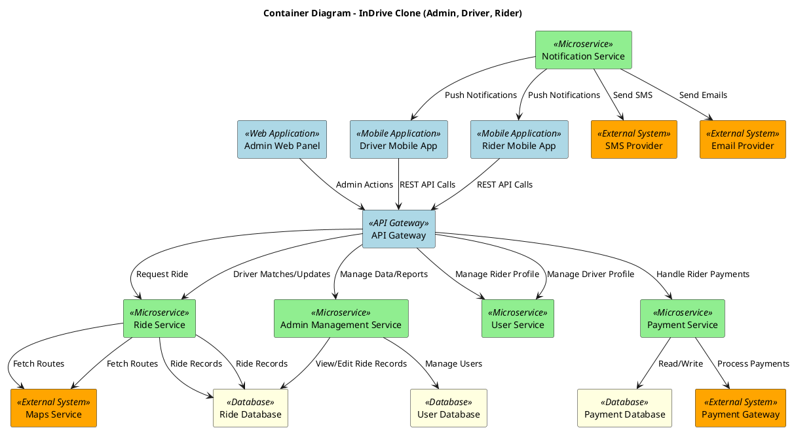
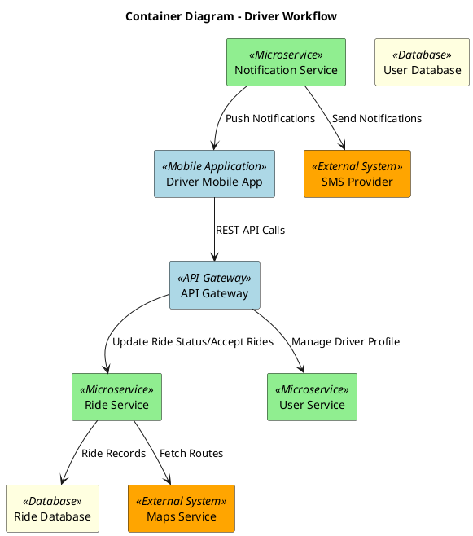
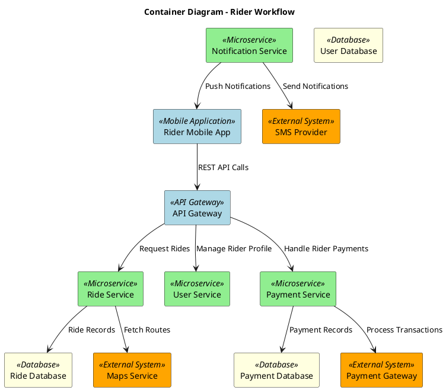
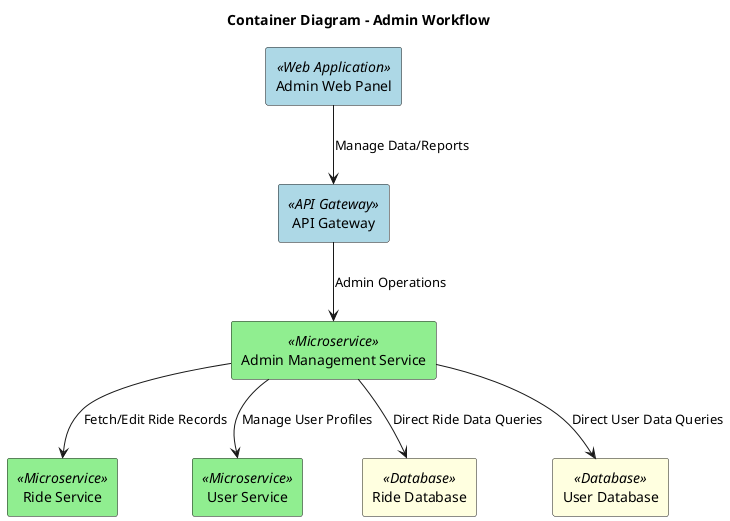
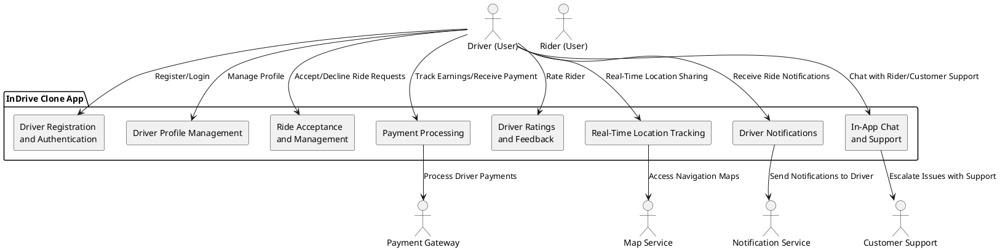
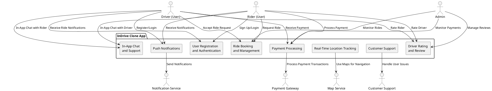
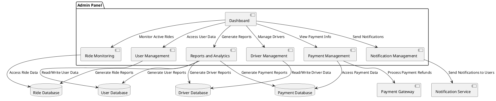
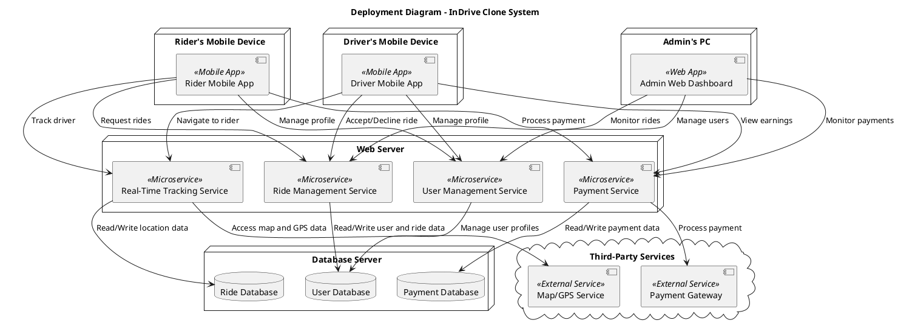

# System Context  Diagram Code

```plantuml
@startuml

' External Actors
actor "Rider (User)" as Rider
actor "Driver (User)" as Driver
actor "Admin" as Admin
actor "Payment Gateway" as PaymentGateway
actor "Map Service" as MapService
actor "Notification Service" as NotificationService
actor "Customer Support" as CustomerSupport

' System Boundary: InDrive Clone App
package "InDrive Clone App" {

    ' Subsystems
    rectangle "User Registration \nand Authentication" as Registration
    rectangle "Ride Booking \nand Management" as RideBooking
    rectangle "Driver Functionality" as DriverFunctionality
    rectangle "Payment Integration" as Payment
    rectangle "Ratings and Reviews" as Ratings
    rectangle "Admin Panel" as AdminPanel
    rectangle "Push Notifications" as PushNotifications
    rectangle "In-App Chat \nand Support" as ChatSupport
    rectangle "Real-Time Location Tracking" as Tracking
    rectangle "Customer Support" as Support
}

' Relationships between actors and system components
Rider --> Registration : Sign Up/Login
Rider --> RideBooking : Request Ride
Rider --> Payment : Process Payment
Rider --> Ratings : Rate Driver
Rider --> PushNotifications : Receive Notifications
Rider --> ChatSupport : In-App Chat with Driver

Driver --> Registration : Register/Login
Driver --> RideBooking : Accept Ride Request
Driver --> DriverFunctionality : Manage Availability
Driver --> Payment : Receive Payment
Driver --> Ratings : Rate Rider
Driver --> PushNotifications : Receive Ride Notifications
Driver --> ChatSupport : In-App Chat with Rider

Admin --> AdminPanel : Manage Users/Drivers/Rides
Admin --> RideBooking : Monitor Rides
Admin --> Payment : Monitor Payments
Admin --> PushNotifications : Send Notifications
Admin --> Ratings : Manage Reviews

' External Interactions
Payment --> PaymentGateway : Process Payment Transactions
Tracking --> MapService : Use Maps for Navigation
PushNotifications --> NotificationService : Send Notifications
Support --> CustomerSupport : Handle User Issues

@enduml
```

# Container Diagram

Here’s the **PlantUML code** for a container diagram considering **Admin**, **Driver**, and **Rider** roles, emphasizing their interactions with the system.  

Here are separate **PlantUML container diagrams** for **Driver**, **Rider**, and **Admin** workflows. Each role has its dedicated architecture, focusing on their specific interactions.  

---

### **Driver Workflow Diagram**

---

### **Rider Workflow Diagram**

---

### **Admin Workflow Diagram**

---
# Component Diagram

Here is the **PlantUML code** for a **combined component diagram** that includes **Admin**, **Rider**, and **Driver** components.

```plantuml
@startuml
title Combined Component Diagram - Admin, Rider, Driver

' External Actors
actor "Rider (User)" as Rider
actor "Driver (User)" as Driver
actor "Admin" as Admin
actor "Payment Gateway" as PaymentGateway
actor "Map Service" as MapService
actor "Notification Service" as NotificationService
actor "Customer Support" as CustomerSupport

' System Boundary: InDrive Clone App
package "InDrive Clone App" {

    ' Rider Components
    component "User Registration \nand Authentication" as Registration
    component "Ride Booking \nand Management" as RideBooking
    component "Payment Processing" as RiderPayment
    component "Driver Rating \nand Review" as RiderRatings
    component "Push Notifications" as RiderNotifications
    component "In-App Chat \nand Support" as RiderChatSupport
    component "Real-Time Location Tracking" as RiderTracking

    ' Driver Components
    component "Driver Registration \nand Authentication" as DriverRegistration
    component "Driver Profile Management" as DriverProfile
    component "Ride Acceptance \nand Management" as RideManagement
    component "Driver Payment Processing" as DriverPayment
    component "Driver Ratings \nand Feedback" as DriverRatings
    component "Driver Notifications" as DriverNotifications
    component "Driver Real-Time \nLocation Tracking" as DriverTracking
    component "Driver In-App Chat \nand Support" as DriverChatSupport

    ' Admin Components
    component "Admin Dashboard" as AdminDashboard
    component "User Management" as UserManagement
    component "Driver Management" as DriverManagement
    component "Ride Monitoring" as RideMonitoring
    component "Payment Management" as PaymentManagement
    component "Reports and Analytics" as ReportsAnalytics
    component "Notification Management" as NotificationManagement
}

' Relationships for Rider
Rider --> Registration : Sign Up/Login
Rider --> RideBooking : Request Ride
Rider --> RiderPayment : Process Payment
Rider --> RiderRatings : Rate Driver
Rider --> RiderNotifications : Receive Notifications
Rider --> RiderChatSupport : Chat with Driver
Rider --> RiderTracking : Track Driver Location

' Relationships for Driver
Driver --> DriverRegistration : Sign Up/Login
Driver --> DriverProfile : Manage Profile
Driver --> RideManagement : Accept/Decline Rides
Driver --> DriverPayment : Track Earnings/Receive Payment
Driver --> DriverRatings : Rate Rider
Driver --> DriverNotifications : Receive Notifications
Driver --> DriverTracking : Share Location
Driver --> DriverChatSupport : Chat with Rider

' Relationships for Admin
Admin --> AdminDashboard : Access Dashboard
Admin --> UserManagement : Manage Users
Admin --> DriverManagement : Manage Drivers
Admin --> RideMonitoring : Monitor Rides
Admin --> PaymentManagement : Monitor Payments
Admin --> ReportsAnalytics : Generate Reports
Admin --> NotificationManagement : Manage Notifications

' External Interactions
RiderTracking --> MapService : Access Maps for Navigation
DriverTracking --> MapService : Access Maps for Navigation
RiderPayment --> PaymentGateway : Process Rider Payments
DriverPayment --> PaymentGateway : Process Driver Payments
RiderNotifications --> NotificationService : Push Notifications
DriverNotifications --> NotificationService : Push Notifications
RiderChatSupport --> CustomerSupport : Escalate Issues
DriverChatSupport --> CustomerSupport : Escalate Issues

@enduml
```

---
Below are the **PlantUML** codes for the diagrams related to the **InDrive Clone System**, focusing on the **Driver**, **Rider**, and **Admin**.

---

### **1. Driver Component Diagram**

---

### **2. Rider Component Diagram**

---

### **3. Admin Component Diagram**

---

# Deployment Diagram

